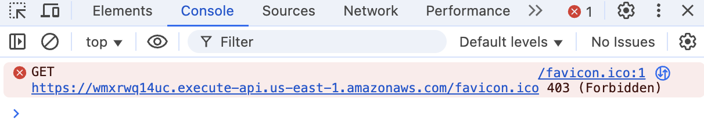

# Bug Report: Missing Favicon Icon Results in 403 Error on Both Login and Dashboard Pages

---

## Bug ID:
API-001

---

## Title:
Missing Favicon Icon Results in 403 Error on Both Login and Dashboard Pages

---

## Application:
Paylocity Benefits Dashboard

---

## Description:
The browser attempts to load a favicon from the API URL `https://wmxrwq14uc.execute-api.us-east-1.amazonaws.com/favicon.ico` on both the login and dashboard pages. However, this request fails with a **403 Forbidden** error, as observed in the developer console. This issue occurs consistently and leads to unnecessary errors in the console, which can distract developers during debugging and affect the perceived quality of the application.

---

## Steps to Reproduce:
1. Open the Paylocity Benefits Dashboard login page in a browser.
2. Open the browser's developer tools (usually by pressing `F12` or `Ctrl+Shift+I`).
3. Navigate to the "Console" tab.
4. Observe the **403 Forbidden** error for the favicon request.
5. Log in to access the dashboard page.
6. Observe that the same **403 Forbidden** error appears again for the favicon request.

---

## Expected Result:
1. The application should provide a valid favicon file at the requested URL or specify a correct favicon location in the HTML `<head>` tag.
2. There should be no errors related to the favicon in the developer console.

---

## Actual Result:
1. On both the login and dashboard pages, the browser attempts to load the favicon from `https://wmxrwq14uc.execute-api.us-east-1.amazonaws.com/favicon.ico`.
2. The request fails with a **403 Forbidden** error, which is logged in the developer console.

---

## Severity:
- **Minor** (Does not impact core functionality but affects the application's perceived quality and may distract developers during debugging).

---

## Environment:
- **OS**: macOS 15.1 (24B83)  
- **Browser**: Google Chrome Version 131.0.6778.265 (Official Build) (arm64)  
- **Device**: MacBook Pro M2 2022  

---

## Additional Details:
- **URL**: [Favicon Request](https://wmxrwq14uc.execute-api.us-east-1.amazonaws.com/favicon.ico)
- **Error Message:**  GET https://wmxrwq14uc.execute-api.us-east-1.amazonaws.com/favicon.ico 403 (Forbidden)
- **Impact:** This issue occurs on both the login and dashboard pages.
- **Screenshots:** 

