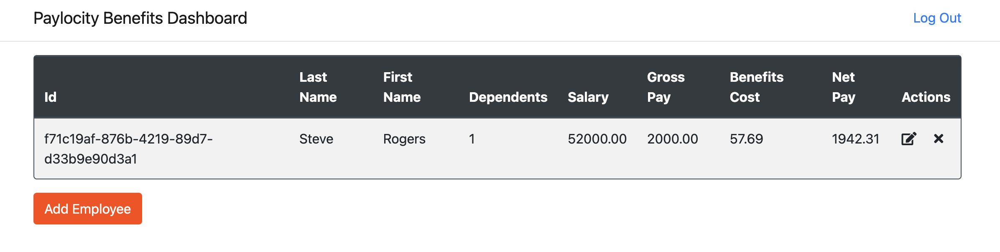

# Bug Report: Missing Employer Profile Management Functionality

---

## Bug ID:
UI-002

---

## Title:
No Option to View or Edit Employer Profile on Dashboard

---

## Application:
Paylocity Benefits Dashboard

---

## Description:
After logging in, the employer is directly taken to the main dashboard, which lacks functionality to view or edit the employer's profile. The only available option is the "Log Out" button. There is no way to manage account details, such as changing the password or updating personal information. This creates confusion for users, as there is no clarity on which employer account is currently logged in.

---

## Steps to Reproduce:
1. Log in to the Paylocity Benefits Dashboard as an employer.
2. Observe that the main dashboard appears immediately after login.
3. Note the absence of any "Profile" or "Account Management" options on the dashboard.
4. Verify that the only account-related functionality available is the "Log Out" button.

---

## Expected Result:
The dashboard should include a "Profile" section where employers can:
- View and update their account details (e.g., name, email, or password).
- Clearly identify which employer account is currently logged in.
- Access a user-friendly account management interface.

---

## Actual Result:
There is no option to view or edit the employer profile. The dashboard only includes a "Log Out" button, leaving users unable to manage their account details or confirm their identity.

---

## Severity:
- **Major** (Critical if profile management is a core requirement for the application).

---

## Environment:
- **OS**: macOS 15.1 (24B83)  
- **Browser**: Google Chrome Version 131.0.6778.265 (Official Build) (arm64)  
- **Device**: MacBook Pro M2 2022  

---

## Additional Details:
- **URL**: [Paylocity Dashboard](https://wmxrwq14uc.execute-api.us-east-1.amazonaws.com/Prod/Account/Login)
- **Screenshots:**
  
