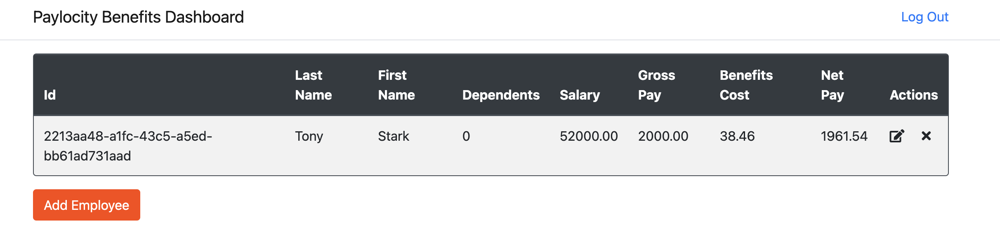

# Bug Report: No Option to Restore Deleted Employees

---

## Bug ID:
UI-004

---

## Title:
No Option to Restore Deleted Employees

---

## Application:
Paylocity Benefits Dashboard

---

## Description:
The application does not provide an option to restore a deleted employee. Once an employee is deleted, there is no functionality to recover their record, leading to potential data loss and requiring manual re-entry of information if the deletion was accidental.

---

## Steps to Reproduce:
1. Log in to the Paylocity Benefits Dashboard as an employer.
2. Delete an employee by clicking the "Delete" button in the employee table.
3. Observe that there is no option to restore the deleted employee or undo the deletion.

---

## Expected Result:
The application should include functionality to restore deleted employees. For example:
- A "Recycle Bin" or "Deleted Records" section where deleted employees can be restored.
- An "Undo" button to immediately revert the deletion.

---

## Actual Result:
Once an employee is deleted, their record is permanently removed from the system with no option to restore it.

---

## Severity:
- **Major** (Critical for preventing accidental data loss).

---

## Environment:
- **OS**: macOS 15.1 (24B83)  
- **Browser**: Google Chrome Version 131.0.6778.265 (Official Build) (arm64)  
- **Device**: MacBook Pro M2 2022  

---

## Additional Details:
- **URL**: [Paylocity Dashboard](https://wmxrwq14uc.execute-api.us-east-1.amazonaws.com/Prod/Account/Login)
- **Screenshots:**
  
