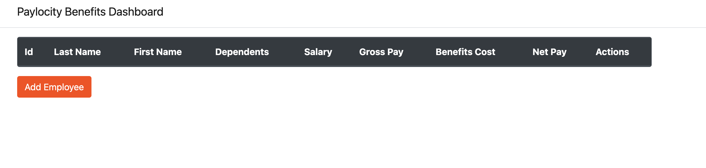

# Bug Report: "Add Employee" Button Becomes Unresponsive After Session Timeout and Other Buttons Fail

---

## Bug ID:
UI-005

---

## Title:
"Add Employee" Button Becomes Unresponsive After Session Timeout and Other Buttons Fail

---

## Description:
When the user remains idle on the dashboard for an extended period, the session silently times out without any warnings. After this, several buttons in the application fail to function:
1. The "Add Employee" button in the "Add Employee" form becomes unresponsive.
2. The "Delete" button in the "Delete Employee" confirmation form does not work.
3. The "Update" button in the "Update Employee" form fails to save changes.  

These issues leave the user unable to complete actions without refreshing the page, which causes data loss. However, if the user does not refresh the page and instead clicks "Log Out," the logout action still works and redirects to the login page.

---

## Steps to Reproduce:
1. Log in to the Paylocity Benefits Dashboard as an employer.
2. Stay idle on the dashboard for an extended period (e.g., ~5 minutes).
3. Attempt the following actions:
   
   ### Issue 1: Add Employee
   1. Click the "Add Employee" button to open the form.
   2. Fill in all fields with valid data.
   3. Click the "Add" button.
   4. Observe that the "Add" button does not work.

   ### Issue 2: Delete Employee
   1. Select an employee from the table.
   2. Click the "Delete" button to open the confirmation form.
   3. Click the "Delete" button in the confirmation form.
   4. Observe that the button does not work, and the employee is not deleted.

   ### Issue 3: Update Employee
   1. Select an employee from the table.
   2. Click the "Edit" button to open the "Update Employee" form.
   3. Make valid changes to the fields.
   4. Click the "Update" button.
   5. Observe that the button does not work, and the changes are not saved.

5. Refresh the page and note that:
   - All entered data is lost.
   - The "Log Out" button disappears.

6. Without refreshing, click the "Log Out" button.
   - Observe that it works and redirects the user to the login page.

---

## Expected Result:
1. The application should display a warning message or countdown before the session times out.
2. If the session has expired:
   - The user should be redirected to the login page.
   - Buttons like "Add", "Delete", and "Update" should remain functional or display a message indicating the session has expired.

---

## Actual Result:
1. The session silently times out without warnings.
2. After timeout:
   - The "Add Employee" button becomes unresponsive.
   - The "Delete" button in the confirmation form does not work.
   - The "Update" button in the "Update Employee" form fails to save changes.
3. Refreshing the page causes:
   - Loss of all entered data.
   - Disappearance of the "Log Out" button.
4. **Without refreshing, clicking the "Log Out" button works and redirects to the login page.**

---

## Severity:
- **Critical** (Impacts usability and prevents completion of key operations).

---

## Environment:
- **OS**: macOS 15.1 (24B83)  
- **Browser**: Google Chrome Version 131.0.6778.265 (Official Build) (arm64)  
- **Device**: MacBook Pro M2 2022  

---

## Additional Details:
- **URL:** [Paylocity Dashboard](https://wmxrwq14uc.execute-api.us-east-1.amazonaws.com/Prod/Account/Login)
- **Screenshots:** 

