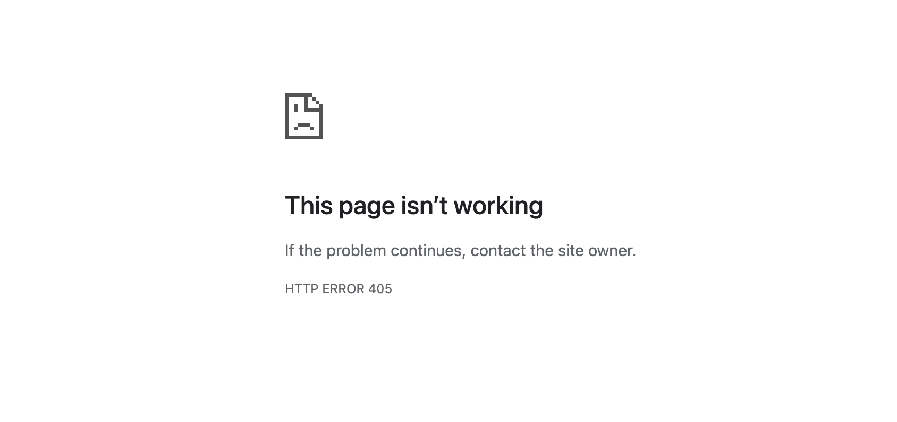

# Bug Report: Incorrect Error Handling for Invalid Username During Login

---

## Bug ID:
UI-006

---

## Title:
Incorrect Error Handling for Invalid Username During Login

---

## Application:
Paylocity Benefits Dashboard

---

## Description:
When attempting to log in with an invalid username, the application displays an HTTP 405 error instead of a user-friendly message indicating that the username or password is incorrect. Additionally, after encountering the 405 error, the user cannot return to the login page using the browser's "Back" button and must manually navigate to the login URL. This behavior creates a poor user experience and adds unnecessary steps for users.

---

## Steps to Reproduce:
1. Open the Paylocity Benefits Dashboard login page.
2. Enter an invalid username and any password.
3. Click the "Login" button.
4. Observe that an HTTP 405 error is displayed.
5. Attempt to return to the login page using the browser's "Back" button.  
   - Note that the login page does not load, and the user must manually navigate to the login URL.

---

## Expected Result:
1. For invalid usernames, the application should display a user-friendly error message:  
   **"The specified username or password is incorrect."**
2. Users should be able to return to the login page using the browser's "Back" button after encountering an error.

---

## Actual Result:
1. For invalid usernames, the application displays an HTTP 405 error.
2. After encountering the 405 error, the browser's "Back" button does not return the user to the login page.

---

## Severity:
- **Major** (Inconsistent error handling affects user experience and requires additional navigation steps).

---

## Environment:
- **OS**: macOS 15.1 (24B83)  
- **Browser**: Google Chrome Version 131.0.6778.265 (Official Build) (arm64)  
- **Device**: MacBook Pro M2 2022  

---

## Additional Details:
- **URL**: [Paylocity Login](https://wmxrwq14uc.execute-api.us-east-1.amazonaws.com/Prod/Account/Login)
- **Screenshots:**
  
