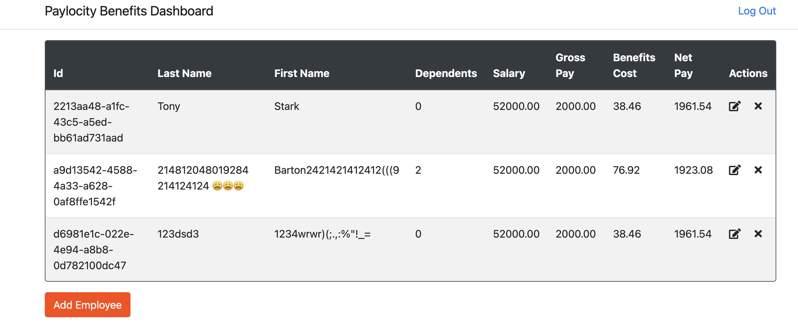

# Bug Report: Name Fields Accept Invalid Characters

---

## Bug ID:
UI-007

---

## Title:
Name Fields Accept Invalid Characters (Symbols, Numbers, and Emojis)

---

## Application:
Paylocity Benefits Dashboard

---

## Description:
The "First Name" and "Last Name" fields in the "Add Employee" form allow the entry of invalid characters such as symbols (`@`, `#`), numbers (`123`), and emojis (`😊`). While some special characters like hyphens (`-`) and apostrophes (`'`) may be acceptable for names (e.g., "Jean-Claude" or "O'Connor"), the fields currently allow unrestricted input, which includes clearly invalid data.

---

## Steps to Reproduce:
1. Log in to the Paylocity Benefits Dashboard as an employer.
2. Click the "Add Employee" button to open the form.
3. In the "First Name" field, enter invalid characters such as `214812048019284 214124124 😩😩😩`.
4. In the "Last Name" field, enter invalid characters such as `1234wrwr)(;.,:%"!_=`.
5. Click the "Add" button.
6. Observe that the form accepts and saves the invalid input without validation.

---

## Expected Result:
1. The "First Name" and "Last Name" fields should validate input and:
   - Allow only alphabetic characters, hyphens (`-`), and apostrophes (`'`).
   - Reject input with numbers, emojis, or other symbols (e.g., `@`, `#`).
2. An error message should be displayed if invalid characters are entered, such as:  
   **"Names can only contain alphabetic characters, hyphens, and apostrophes."**

---

## Actual Result:
1. The "First Name" and "Last Name" fields accept and save any input, including symbols, numbers, and emojis.
2. There is no validation or error message to prevent invalid input.

---

## Severity:
- **Major** (Impacts data integrity and professional presentation).

---

## Environment:
- **OS**: macOS 15.1 (24B83)  
- **Browser**: Google Chrome Version 131.0.6778.265 (Official Build) (arm64)  
- **Device**: MacBook Pro M2 2022  

---

## Additional Details:
- **URL**: [Paylocity Add Employee Form](https://wmxrwq14uc.execute-api.us-east-1.amazonaws.com/Prod/Account/Login)
- **Screenshots:**
  
