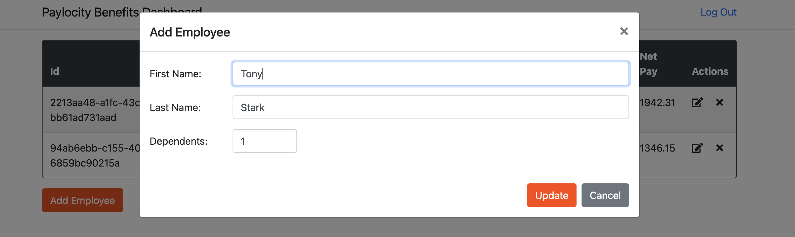

# Bug Report: Update Employee Form Incorrectly Labeled as "Add Employee"

---

## Bug ID:
UI-009

---

## Title:
Update Employee Form Incorrectly Labeled as "Add Employee"

---

## Application:
Paylocity Benefits Dashboard

---

## Description:
The form used to update an existing employee's information is labeled as "Add Employee," which can confuse users. This incorrect labeling may lead users to believe they are adding a new employee instead of updating an existing one. Clear and accurate labeling is essential for a better user experience.

---

## Steps to Reproduce:
1. Log in to the Paylocity Benefits Dashboard as an employer.
2. Navigate to the employee table on the dashboard.
3. Select an employee and click the "Edit" button to update their information.
4. Observe that the form title is displayed as "Add Employee," even though the action is to update an existing employee.

---

## Expected Result:
The form for updating an employee's information should be labeled as "Update Employee" to clearly reflect the intended action.

---

## Actual Result:
The form for updating an employee's information is labeled as "Add Employee," which is incorrect and can confuse users.

---

## Severity:
- **Minor** (Affects user experience but does not block functionality).

---

## Environment:
- **OS**: macOS 15.1 (24B83)  
- **Browser**: Google Chrome Version 131.0.6778.265 (Official Build) (arm64)  
- **Device**: MacBook Pro M2 2022  

---

## Additional Details:
- **URL**: [Paylocity Dashboard](https://wmxrwq14uc.execute-api.us-east-1.amazonaws.com/Prod/Account/Login)
- **Screenshots:**
  
