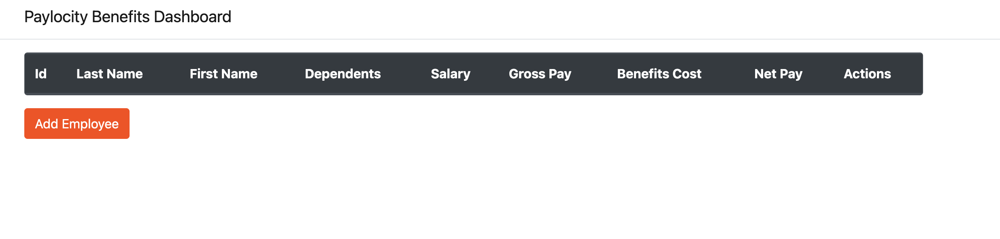

# Bug Report: Clicking on "Paylocity Benefits Dashboard" Redirects to Empty Table with Non-Functional Add Button in Form

---

## Bug ID:
UI-010

---

## Title:
Clicking on "Paylocity Benefits Dashboard" Redirects to Empty Table with Non-Functional Add Button in Form

---

## Application:
Paylocity Benefits Dashboard

---

## Description:
On the login page, clicking on the "Paylocity Benefits Dashboard" title unexpectedly redirects the user to the main dashboard. However, the table is empty, no logout button is displayed, and while the "Add Employee" button opens the form, the "Add" button within the form does not work after entering data. This behavior creates a confusing user experience and prevents the addition of new employees.

---

## Steps to Reproduce:
1. Navigate to the Paylocity Benefits Dashboard login page.
2. Click on the "Paylocity Benefits Dashboard" title at the top of the page.
3. Observe that:
   - You are redirected to the dashboard page.
   - The table is empty with no employee data.
   - The "Log Out" button is missing.
4. Click the "Add Employee" button to open the form.
5. Fill in all fields in the "Add Employee" form with valid data.
6. Click the "Add" button in the form.
7. Observe that:
   - The "Add" button does not work.
   - No employee is added to the table.

---

## Expected Result:
1. Clicking the "Paylocity Benefits Dashboard" title should not redirect the user without proper authentication.

---

## Actual Result:
1. Clicking the "Paylocity Benefits Dashboard" title redirects the user to the dashboard without proper authentication.
2. The redirected dashboard displays:
   - An empty table with no data.
   - No "Log Out" button.
   - A working "Add Employee" button that opens the form.
3. The "Add" button in the form is non-functional, and no employee is added.

---

## Severity:
- **Critical** (Impacts usability and exposes unauthorized access to parts of the application).

---

## Environment:
- **OS**: macOS 15.1 (24B83)  
- **Browser**: Google Chrome Version 131.0.6778.265 (Official Build) (arm64)  
- **Device**: MacBook Pro M2 2022  

---

## Additional Details:
- **URL**: [Paylocity Login](https://wmxrwq14uc.execute-api.us-east-1.amazonaws.com/Prod/Account/Login)
- **Screenshots:**
    
