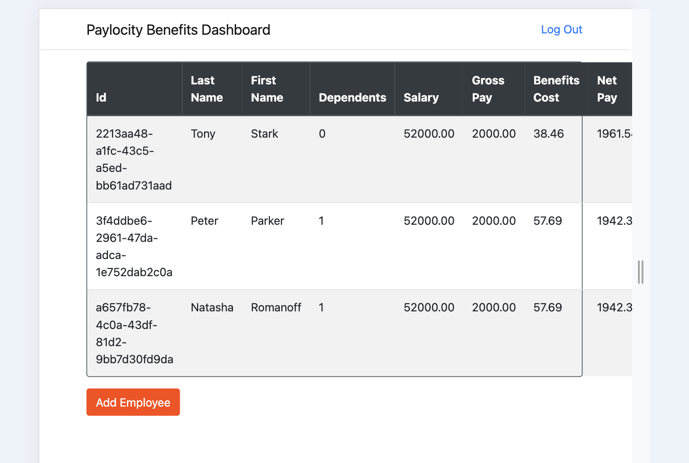

# Bug Report: Right Border of Table Appears in the Middle of the Table in Mobile View

---

## Bug ID:
UI-011

---

## Title:
Right Border of Table Appears in the Middle of the Table in Mobile View

---

## Application:
Paylocity Benefits Dashboard

---

## Description:
When switching to the mobile view in the developer console, the right border of the table incorrectly appears in the middle of the table instead of at the edge. This issue distorts the table layout and negatively impacts the user experience on mobile devices.

---

## Steps to Reproduce:
1. Open the Paylocity Benefits Dashboard in a browser.
2. Open the developer tools (`F12`).
3. Switch to the mobile view by enabling the responsive design mode in the developer tools.
4. Observe the table on the dashboard.
5. Note that the right border of the table appears in the middle of the table content.

---

## Expected Result:
The table layout should adapt correctly to the mobile view, with the right border positioned at the edge of the table.

---

## Actual Result:
The right border of the table appears in the middle of the table, misaligning the content and disrupting the layout.

---

## Severity:
- **Major** (Impacts the layout and usability on mobile devices).

---

## Environment:
- **OS**: macOS 15.1 (24B83)  
- **Browser**: Google Chrome Version 131.0.6778.265 (Official Build) (arm64)  
- **Device:** MacBook Pro M2 2022  
- **View Mode:** Mobile (Responsive Design Mode in Developer Console)

---

## Additional Details:
- **URL:** [Paylocity Dashboard](https://wmxrwq14uc.execute-api.us-east-1.amazonaws.com/Prod/Account/Login)
- **Screenshots:**
  
