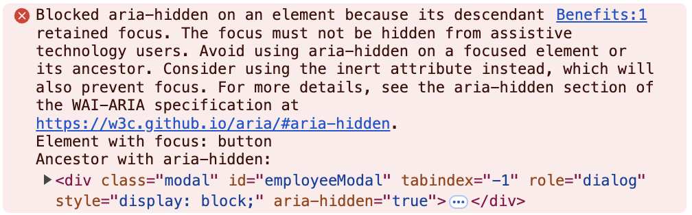

# Observation: Accessibility Error Appears in Console During Mobile View

---

## Observation ID:
OBS-001

---

## Title:
Accessibility Error "Blocked aria-hidden on an element" Appears in Console During Mobile View

---

## Application:
Paylocity Benefits Dashboard

---

## Description:
While testing the mobile view in the developer console, an error related to accessibility appears consistently in the console:  
**"Blocked aria-hidden on an element because its descendant retained focus. The focus must not be hidden from assistive technology users."**  
The exact impact of this error on the application is unclear, but it may indicate potential accessibility issues.

---

## Steps to Reproduce:
1. Open the Paylocity Benefits Dashboard in a browser.
2. Enable developer tools (`F12`) and switch to the mobile view.
3. Interact with the modal (e.g., open the "Add Employee" or "Edit Employee" form).
4. Observe the developer console for the error message.

---

## Console Error Message:
Blocked aria-hidden on an element because its descendant retained focus. The focus must not be hidden from assistive technology users.

---

## Expected Result
The console should not display errors related to accessibility during normal operation.

---

## Actual Result
The console displays an accessibility-related error when interacting with modals in the mobile view.

---

## Severity
**Low** (Requires further investigation to determine the impact on functionality and accessibility).

---

## Environment
- **OS**: macOS 15.1 (24B83)  
- **Browser**: Google Chrome Version 131.0.6778.265 (Official Build) (arm64)  
- **Device**: MacBook Pro M2 2022  
- **View Mode**: Mobile (Responsive Design Mode in Developer Console)

---

## Additional Details
- **URL**: [Paylocity Dashboard](https://wmxrwq14uc.execute-api.us-east-1.amazonaws.com/Prod/Account/Login)
- **Screenshots**:  
    
